# Hi, I'm Rocky Chi

> Backend engineer who accidentally became an **AI whisperer**. I make agents behave — most of the time.
>
> [longer version of me →](https://chingjustwe.github.io/portfolio/)

  &nbsp;
  &nbsp;
  &nbsp;
  &nbsp;
  &nbsp;
  &nbsp;
  &nbsp;
  &nbsp;
  

---

## 🚀 Projects
<small>things I broke & built</small>

<table>
  <tr>
    <td width="33%" valign="top" align="center">
      
      <h3>🛡️ LLM Interceptor</h3>
      
Peek under the hood of every LLM call. Like a firewall, but for your prompts.

      
<code>Go</code> · <code>Bytecode</code> · <code>Guardrails</code>

      
<a href="https://chingjustwe.github.io/llm-interceptor/">→ live demo</a>

    </td>
    <td width="33%" valign="top" align="center">
      
      <h3>💻 CodeCode</h3>
      
Code snippets that actually run. Less README lies, more working examples.

      
<code>React</code> · <code>Monaco</code> · <code>Live Code</code>

      
<a href="https://chingjustwe.github.io/codecode/">→ live demo</a>

    </td>
    <td width="33%" valign="top" align="center">
      
      <h3>🤖 Agent Forge</h3>
      
Agents that don't misbehave in production. Gateway bouncer → guardrail harness → runtime, with observability side-eyeing every step.

      
<code>Python</code> · <code>Gateway</code> · <code>Observability</code>

      
<a href="https://chingjustwe.github.io/agent-forge/">→ live demo</a>

    </td>
  </tr>
</table>

---

## 🧰 Tech Stack
<small>what's in the toolbox</small>

**AI / Agent / AIOps**

**Languages & Frameworks**

**Distributed & Data**

**DevOps / Observability**

---

## 📫 Say Hi
<small>I don't bite (unless you're a flaky test)</small>

---

  © 2026 Rocky Chi · Built with too much coffee and a stubborn SVG.

